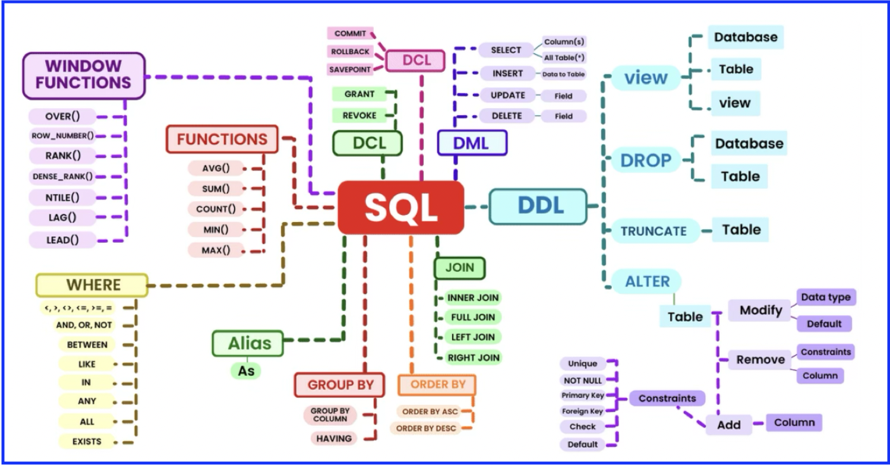

````markdown
# DDL & DML Sample

## Purpose
This section defines the **database schema** (DDL) and inserts sample data (DML) for departments and employees.  
It sets up the environment for running queries later.

```sql
CREATE DATABASE learning;
USE learning;

-- Define Departments Table
CREATE TABLE departments (
    department_id integer(4),
    department_name varchar(30) NOT NULL,
    manager_id integer(6),
    location_id integer(4)
);

-- Define Employees Table
CREATE TABLE employees (
    employee_id integer(6),
    first_name varchar(20),
    last_name varchar(25) NOT NULL,
    email varchar(25) NOT NULL,
    phone_integer varchar(20),
    hire_date DATE NOT NULL,
    job_id varchar(10) NOT NULL,
    salary integer(8),
    commission_pct integer(2),
    manager_id integer(6),
    department_id integer(4)
);

-- Insert into departments (sample records)
INSERT INTO departments VALUES (10, 'Administration', 200, 1700);
INSERT INTO departments VALUES (20, 'Marketing', 201, 1800);
...
INSERT INTO departments VALUES (270, 'Payroll', NULL, 1700);

-- Insert into employees (sample records)
INSERT INTO employees VALUES (100, 'Steven', 'King', 'SKING', '515.123.4567', '1987-05-01', 'AD_PRES', 24000, NULL, NULL, 90);
INSERT INTO employees VALUES (101, 'Neena', 'Kochhar', 'NKOCHHAR', '515.123.4568', '1989-06-05', 'AD_VP', 17000, NULL, 100, 90);
...
````

---

# DQL Queries

These queries demonstrate **different SQL operations** including joins, subqueries, ranking, analytical queries, and views.

---

### 1. Self Join

**Description:** Find employees and their managers within the same table.
**Purpose:** To show hierarchical relationships in the `employees` table.

```sql
SELECT e1.last_name || ' works for ' || e2.last_name "employees and Their Managers",
       e1.*, e2.last_name
FROM employees e1
JOIN employees e2
    ON e1.manager_id = e2.employee_id
   AND e1.last_name LIKE 'R%'
ORDER BY e1.last_name;
```

---

### 2. Left Outer Join

**Description:** Returns all departments and employees (if any) in each department.
**Purpose:** Ensures departments without employees are still displayed.

```sql
SELECT d.department_id, e.last_name
FROM departments d
LEFT OUTER JOIN employees e
    ON d.department_id = e.department_id
ORDER BY d.department_id, e.last_name;
```

---

### 3. Right Outer Join

**Description:** Returns all employees and their department details (if available).
**Purpose:** Ensures employees are shown even if they are not assigned to a department.

```sql
SELECT d.department_id, e.last_name
FROM departments d
RIGHT OUTER JOIN employees e
    ON d.department_id = e.department_id
ORDER BY d.department_id, e.last_name;
```

```sql
-- Deleting department with ID 100
DELETE FROM departments
WHERE department_id = 100;
```

---

### 4. Full Outer Join

**Description:** Combines results of left and right joins.
**Purpose:** Shows all departments and employees, even if no match exists.

```sql
SELECT d.department_id, e.last_name
FROM departments d
LEFT OUTER JOIN employees e
    ON d.department_id = e.department_id
UNION ALL
SELECT d.department_id, e.last_name
FROM departments d
RIGHT OUTER JOIN employees e
    ON d.department_id = e.department_id;
```

---

### 5. Sub Query Example

**Description:** Select employees **not** in departments located at `location_id = 1700`.
**Purpose:** Demonstrates filtering using a subquery.

```sql
SELECT *
FROM employees
WHERE department_id NOT IN (
    SELECT department_id
    FROM departments
    WHERE location_id = 1700
)
ORDER BY last_name;
```

---

### 6. Top 10 Salary Employees

**Description:** Finds the top 10 employees based on salary.
**Purpose:** Demonstrates ranking with `RANK()` and filtering top N rows.

```sql
SELECT *
FROM (
    SELECT RANK() OVER (ORDER BY salary) AS rn
    FROM employees
) AS t1
WHERE rn < 11;
```

---

### 7. Ranking Functions

**Description:** Demonstrates `RANK`, `ROW_NUMBER`, and `DENSE_RANK` on employees based on hire date.
**Purpose:** Useful for analytics like employee seniority or ranking.

```sql
SELECT employee_id, first_name, job_id, hire_date, salary,
       RANK() OVER (ORDER BY hire_date) AS hire_seq_rank,
       ROW_NUMBER() OVER (ORDER BY hire_date) AS hire_seq_RN,
       DENSE_RANK() OVER (ORDER BY hire_date) AS hire_seq_dense_rank
FROM employees;
```

---

### 8. View Example

**Description:** Creates a reusable view joining employees and departments.
**Purpose:** Simplifies reporting and query reuse.

```sql
CREATE OR REPLACE VIEW emp_details_view AS
SELECT e.employee_id,
       e.job_id,
       e.manager_id,
       e.department_id,
       d.department_name
FROM employees e
INNER JOIN departments d
    ON e.department_id = d.department_id;
```

---

### 9. Sub Queries (Single Row)

**Description:** Returns departments matching one subquery result.
**Purpose:** Filters with a **single-value subquery**.

```sql
SELECT *
FROM hr.departments
WHERE department_name = (
    SELECT department_name
    FROM hr.departments
    WHERE department_name = 'IT'
);
```

---

### 10. Sub Queries (Multiple Rows)

**Description:** Returns departments matching multiple department names.
**Purpose:** Uses `IN` clause with subqueries.

```sql
SELECT *
FROM hr.departments
WHERE department_name IN (
    SELECT department_name
    FROM hr.departments
    WHERE department_name = 'IT'
       OR department_name = 'Administration'
);
```

---

### 11. Sub Queries (Multiple Columns)

**Description:** Filters based on both `department_id` and `department_name`.
**Purpose:** Shows how to handle **multi-column conditions** in subqueries.

```sql
SELECT *
FROM hr.departments
WHERE (department_id, department_name) IN (
    SELECT department_id, department_name
    FROM hr.departments
    WHERE department_name = 'IT'
       OR department_name = 'Administration'
);
```

---

### 12. Inline View

**Description:** Uses a subquery inside `FROM` to find minimum salary per department.
**Purpose:** Useful for comparisons and analytics.

```sql
SELECT e.employee_id, a.department_id, e.last_name, e.salary, a.min_sal
FROM hr.employees e,
     (SELECT MIN(salary) min_sal, department_id
      FROM hr.employees
      GROUP BY department_id) a
WHERE e.department_id = a.department_id
ORDER BY e.department_id, e.salary DESC;
```

---

### 13. Top-N Analysis

**Description:** Fetches top 5 highest-paid employees.
**Purpose:** Demonstrates use of `ROWNUM` for pagination or ranking.

```sql
SELECT *
FROM (
    SELECT e.employee_id, e.last_name, e.salary
    FROM hr.employees e
    ORDER BY e.salary DESC
)
WHERE ROWNUM < 6;
```

---

### 14. Analytical Queries

**Description:** Demonstrates advanced analytics with ranking, row numbering, partitioning.
**Purpose:** Useful for **business insights, leaderboards, and reporting**.

```sql
SELECT NAME, company, power,
       RANK() OVER(ORDER BY power DESC) AS RANK,
       ROW_NUMBER() OVER(ORDER BY power DESC) AS Row_Number
FROM cars1;
```

```sql
WITH cte AS (
    SELECT NAME, company, power,
           ROW_NUMBER() OVER (PARTITION BY NAME, company ORDER BY power DESC) AS Row_Number
    FROM cars1
)
SELECT *
FROM cte
WHERE NAME = 'Prius' AND Row_Number = 1;
```

```sql
SELECT *
FROM (
    SELECT NAME, company, power,
           DENSE_RANK() OVER (PARTITION BY company ORDER BY power) AS dn
    FROM cars1
    ORDER BY company
)
WHERE company = 'Toyota';
```

